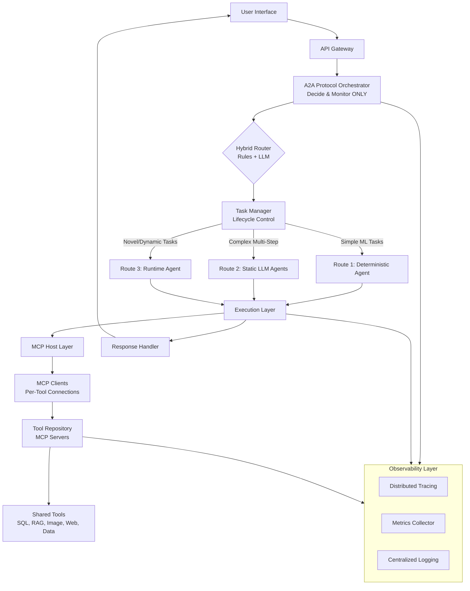
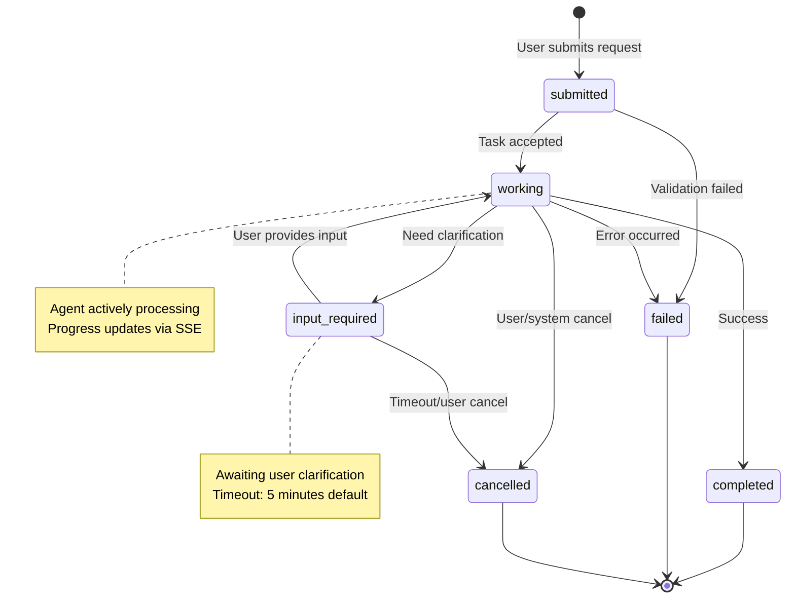
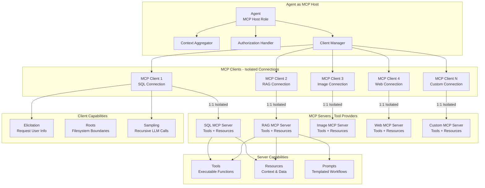
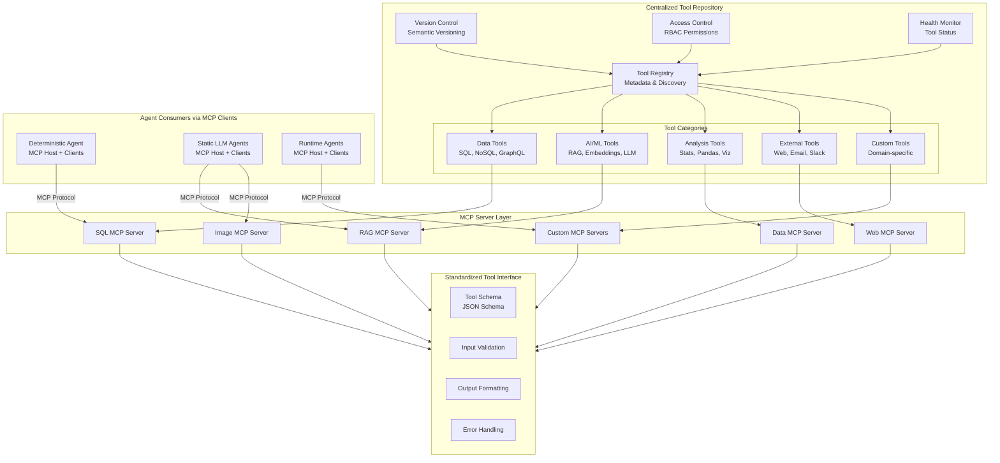
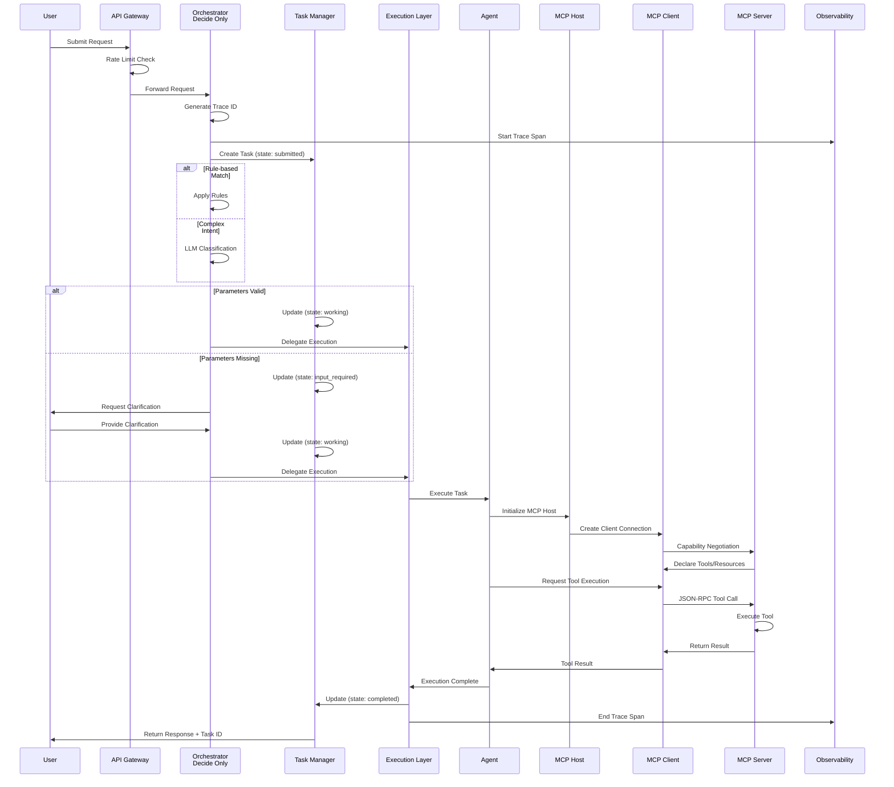
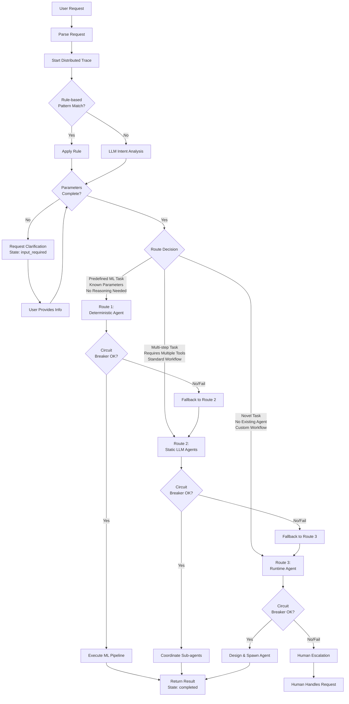
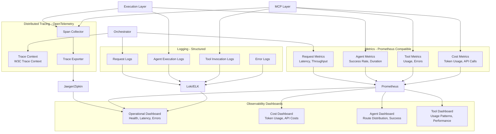
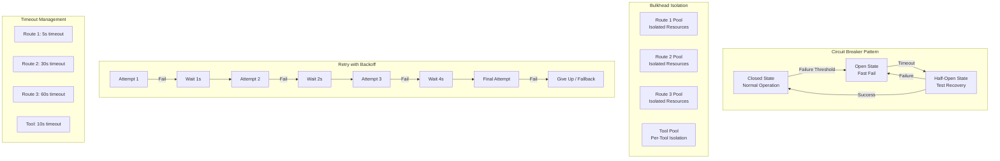
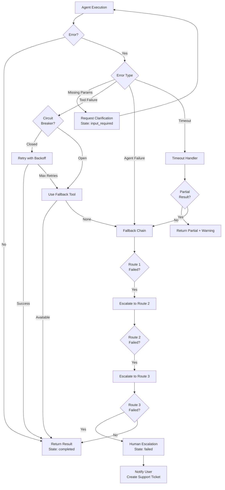

# Multi-Agent System Architecture Design (v2.0)

## Overview

This design presents an A2A (Agent-to-Agent) protocol-based orchestrator that intelligently routes user requests to one of three agent types: Deterministic ML Pipeline Agent, Static LLM-Driven Multi-Agent System, or Runtime Dynamic Agent. The system features a centralized Tool Repository for tool reusability across all agents.

**Industry Standards Incorporated:**
- Google A2A Protocol (v0.1.0) - Agent Cards, Task Lifecycle
- Anthropic MCP Protocol - Host-Client-Server Architecture
- Supervisor/Coordinator Pattern - Orchestrator never executes
- Observability & Distributed Tracing
- Resilience Patterns - Circuit Breakers, Bulkheads

---

## Architecture Components

### 1. High-Level System Architecture



### 2. Detailed Component Architecture (Industry-Aligned)

```mermaid
graph TB
    subgraph UserLayer [User Interaction Layer]
        UI[User Interface]
        InputParser[Input Parser]
        ResponseFormatter[Response Formatter]
        APIGateway[API Gateway<br/>Rate Limiting]
    end
    
    subgraph OrchestratorLayer [A2A Orchestrator Layer - NO EXECUTION]
        A2AProtocol[A2A Protocol Handler<br/>JSON-RPC 2.0 over HTTP]
        AgentRegistry[Agent Registry<br/>Agent Cards Discovery]
        HybridRouter[Hybrid Router]
        RuleEngine[Rule-Based Engine]
        LLMClassifier[LLM Intent Classifier]
        ParamValidator[Parameter Validator]
        ClarificationEngine[Clarification Engine]
        TaskManager[Task Manager<br/>Lifecycle States]
    end
    
    subgraph ExecutionLayer [Execution Layer - Separated from Orchestrator]
        ExecutionController[Execution Controller]
        Route1Executor[Route 1 Executor]
        Route2Executor[Route 2 Executor]
        Route3Executor[Route 3 Executor]
    end
    
    subgraph Route1Layer [Route 1: Deterministic ML Agent]
        DetAgent[Deterministic Agent]
        PipelineSelector[Pipeline Selector]
        ParamMapper[Parameter Mapper]
        MLPipeline1[ML Pipeline 1]
        MLPipeline2[ML Pipeline 2]
        MLPipelineN[ML Pipeline N]
    end
    
    subgraph Route2Layer [Route 2: Static LLM Multi-Agent]
        Coordinator[Agent Coordinator]
        SQLAgent[SQL Agent]
        RAGAgent[RAG Agent]
        ImageAgent[Image Analysis Agent]
        WebAgent[Web Search Agent]
        DataAgent[Data Analysis Agent]
        AgentMemory[Shared Memory<br/>Blackboard Pattern]
    end
    
    subgraph Route3Layer [Route 3: Runtime Dynamic Agent]
        DynamicEngine[Dynamic Agent Engine]
        AgentDesigner[Agent Designer]
        CapabilityAnalyzer[Capability Analyzer]
        AgentSpawner[Agent Spawner]
        RuntimeAgent1[Runtime Agent Instance]
    end
    
    subgraph MCPLayer [MCP Host-Client-Server Architecture]
        MCPHost[MCP Host<br/>Context Aggregation]
        MCPClient1[MCP Client 1]
        MCPClient2[MCP Client 2]
        MCPClientN[MCP Client N]
    end
    
    subgraph ToolLayer [Tool Repository - MCP Servers]
        ToolRegistry[Tool Registry]
        ToolVersioning[Tool Versioning]
        ToolDiscovery[Tool Discovery Service]
        
        SQLServer[SQL MCP Server]
        RAGServer[RAG MCP Server]
        ImageServer[Image MCP Server]
        WebServer[Web Search MCP Server]
        DataServer[Data Analysis MCP Server]
        CustomServer[Custom MCP Servers]
    end
    
    subgraph DataLayer [Data & State Management]
        SessionStore[Session Store]
        ConversationHistory[Conversation History]
        AgentState[Agent State]
        ResultCache[Result Cache]
        TaskStore[Task State Store]
    end
    
    subgraph ObservabilityLayer [Observability Layer]
        TraceCollector[Trace Collector<br/>OpenTelemetry]
        MetricsAggregator[Metrics Aggregator<br/>Prometheus]
        LogAggregator[Log Aggregator<br/>ELK/Loki]
        CostTracker[Cost Tracker<br/>Token Usage]
    end
    
    subgraph ResilienceLayer [Resilience Layer]
        CircuitBreaker[Circuit Breakers<br/>Per Agent/Tool]
        Bulkhead[Bulkhead Isolation<br/>Per Route]
        RetryHandler[Retry Handler<br/>Exponential Backoff]
    end
    
    UI --> APIGateway
    APIGateway --> InputParser
    InputParser --> A2AProtocol
    A2AProtocol --> AgentRegistry
    A2AProtocol --> HybridRouter
    
    HybridRouter --> RuleEngine
    HybridRouter --> LLMClassifier
    
    RuleEngine --> ParamValidator
    LLMClassifier --> ParamValidator
    
    ParamValidator -->|Valid| TaskManager
    ParamValidator -->|Invalid| ClarificationEngine
    ClarificationEngine --> UI
    
    TaskManager -->|Delegate| ExecutionController
    
    ExecutionController --> Route1Executor
    ExecutionController --> Route2Executor
    ExecutionController --> Route3Executor
    
    Route1Executor --> DetAgent
    Route2Executor --> Coordinator
    Route3Executor --> DynamicEngine
    
    DetAgent --> PipelineSelector
    PipelineSelector --> ParamMapper
    ParamMapper --> MLPipeline1
    ParamMapper --> MLPipeline2
    ParamMapper --> MLPipelineN
    
    Coordinator --> SQLAgent
    Coordinator --> RAGAgent
    Coordinator --> ImageAgent
    Coordinator --> WebAgent
    Coordinator --> DataAgent
    
    SQLAgent --> AgentMemory
    RAGAgent --> AgentMemory
    ImageAgent --> AgentMemory
    WebAgent --> AgentMemory
    DataAgent --> AgentMemory
    
    DynamicEngine --> CapabilityAnalyzer
    CapabilityAnalyzer --> AgentDesigner
    AgentDesigner --> AgentSpawner
    AgentSpawner --> RuntimeAgent1
    
    DetAgent --> MCPHost
    SQLAgent --> MCPHost
    RAGAgent --> MCPHost
    ImageAgent --> MCPHost
    WebAgent --> MCPHost
    DataAgent --> MCPHost
    RuntimeAgent1 --> MCPHost
    
    MCPHost --> MCPClient1
    MCPHost --> MCPClient2
    MCPHost --> MCPClientN
    
    MCPClient1 --> SQLServer
    MCPClient2 --> RAGServer
    MCPClientN --> CustomServer
    
    SQLServer --> ToolRegistry
    RAGServer --> ToolRegistry
    ImageServer --> ToolRegistry
    WebServer --> ToolRegistry
    DataServer --> ToolRegistry
    CustomServer --> ToolRegistry
    
    ToolVersioning --> ToolRegistry
    ToolDiscovery --> ToolRegistry
    
    MLPipeline1 --> ResultCache
    MLPipeline2 --> ResultCache
    MLPipelineN --> ResultCache
    AgentMemory --> ResultCache
    RuntimeAgent1 --> ResultCache
    
    TaskManager --> TaskStore
    A2AProtocol --> SessionStore
    SessionStore --> ConversationHistory
    ConversationHistory --> AgentState
    
    ResultCache --> ResponseFormatter
    ResponseFormatter --> UI
    
    ExecutionController --> CircuitBreaker
    CircuitBreaker --> Bulkhead
    Bulkhead --> RetryHandler
    
    A2AProtocol --> TraceCollector
    ExecutionController --> TraceCollector
    MCPHost --> TraceCollector
    TraceCollector --> MetricsAggregator
    MetricsAggregator --> LogAggregator
    MCPHost --> CostTracker
```



### 3. A2A Protocol - Agent Cards & Discovery

```mermaid
graph TB
    subgraph AgentDiscovery [Agent Discovery - A2A Protocol Standard]
        WellKnown[/.well-known/agent.json]
        
        subgraph AgentCards [Agent Cards Registry]
            OrchestratorCard[Orchestrator Agent Card<br/>capabilities, auth, endpoints]
            SQLAgentCard[SQL Agent Card<br/>skills: query, schema]
            RAGAgentCard[RAG Agent Card<br/>skills: retrieve, embed]
            ImageAgentCard[Image Agent Card<br/>skills: analyze, detect]
            WebAgentCard[Web Agent Card<br/>skills: search, scrape]
            DataAgentCard[Data Agent Card<br/>skills: analyze, visualize]
            DynamicAgentCard[Dynamic Agent Cards<br/>runtime-generated]
        end
    end
    
    subgraph CardSchema [Agent Card Schema]
        Name[name: string]
        Description[description: string]
        URL[url: endpoint]
        Capabilities[capabilities: array]
        Authentication[authentication: object]
        InputModes[defaultInputModes: array]
        OutputModes[defaultOutputModes: array]
    end
    
    WellKnown --> OrchestratorCard
    WellKnown --> SQLAgentCard
    WellKnown --> RAGAgentCard
    WellKnown --> ImageAgentCard
    WellKnown --> WebAgentCard
    WellKnown --> DataAgentCard
    WellKnown --> DynamicAgentCard
    
    OrchestratorCard --> CardSchema
```

**Agent Card Example (JSON):**
```json
{
  "name": "SQL Agent",
  "description": "Executes SQL queries and retrieves database schemas",
  "url": "https://agents.example.com/sql",
  "capabilities": {
    "streaming": true,
    "pushNotifications": false
  },
  "authentication": {
    "schemes": ["bearer"]
  },
  "defaultInputModes": ["text"],
  "defaultOutputModes": ["text", "data"],
  "skills": [
    {"id": "query", "name": "Execute SQL Query"},
    {"id": "schema", "name": "Get Database Schema"}
  ]
}
```

### 4. Task Lifecycle Management (A2A Standard)



**Task State Definitions:**

| State | Description | Next States |
|-------|-------------|-------------|
| `submitted` | Task received, pending validation | `working`, `failed` |
| `working` | Agent actively processing | `completed`, `failed`, `input_required`, `cancelled` |
| `input_required` | Awaiting user clarification | `working`, `cancelled` |
| `completed` | Task finished successfully | Terminal |
| `failed` | Task failed with error | Terminal |
| `cancelled` | Task cancelled by user/system | Terminal |

### 5. MCP Host-Client-Server Architecture (Protocol-Aligned)



**MCP Protocol Key Principles:**
- **Security Isolation**: Servers cannot access full conversation history or other servers' data
- **1:1 Connections**: Each client maintains isolated connection to one server
- **Capability Negotiation**: Clients and servers declare features during initialization
- **Transport Options**: stdio, HTTP, WebSocket, SSE

### 6. Tool Repository Architecture (Enhanced)



### 7. Request Flow Sequence (Enhanced with Task Lifecycle)



### 8. Routing Decision Logic (Enhanced with Fallback Chain)



### 9. Observability Architecture



**Key Metrics to Track:**

| Metric | Description | Target |
|--------|-------------|--------|
| `request_latency_p50` | 50th percentile latency | <3s (Route 2) |
| `request_latency_p95` | 95th percentile latency | <6s (Route 2) |
| `agent_success_rate` | Successful task completion | >95% |
| `tool_error_rate` | Tool invocation failures | <1% |
| `token_usage_per_request` | Average tokens consumed | Monitor for cost |
| `route_distribution` | Requests per route | Balanced |
| `circuit_breaker_trips` | Circuit breaker activations | <0.1% |

### 10. Resilience Patterns



### 11. Error Handling & Fallback Chain



---

## Key Design Principles (Industry-Aligned)

### 1. **A2A Protocol Orchestrator (Google A2A v0.1.0)**

- **CRITICAL**: Orchestrator ONLY decides and monitors - NEVER executes
- Central hub for agent-to-agent communication via JSON-RPC 2.0 over HTTP(S)
- Agent discovery via Agent Cards at `/.well-known/agent.json`
- Task lifecycle management with defined states
- Supports streaming (SSE) and push notifications

### 2. **MCP Protocol Integration (Anthropic MCP)**

- **Host-Client-Server Architecture**:
  - Agents act as MCP Hosts (context aggregation, client management)
  - MCP Clients maintain isolated 1:1 connections to servers
  - MCP Servers provide tools, resources, and prompts
- Security isolation between servers
- Capability negotiation during initialization
- Transport: stdio, HTTP, WebSocket, SSE

### 3. **Hybrid Routing Strategy**

- **Rule-based Engine**: Fast routing for known patterns (keywords, task types)
- **LLM Classifier**: Intelligent intent analysis for ambiguous requests
- **Parameter Validation**: Ensures all required inputs are present before execution
- **Clarification Loop**: Automatically requests missing information from users

### 4. **Route 1: Deterministic ML Agent**

- **Purpose**: Execute predefined ML pipelines with known parameters
- **Characteristics**:
  - No reasoning or decision-making
  - Direct pipeline invocation
  - Fast execution (<500ms P50)
  - Predictable outcomes
- **Use Cases**: Model inference, data preprocessing, batch predictions
- **Parameter Handling**: Strict validation, immediate clarification if missing

### 5. **Route 2: Static LLM-Driven Multi-Agent**

- **Purpose**: Complex tasks requiring multiple specialized agents
- **Sub-agents**:
  - **SQL Agent**: Database queries and data retrieval
  - **RAG Agent**: Document retrieval and context augmentation
  - **Image Analysis Agent**: Computer vision tasks
  - **Web Search Agent**: External information gathering
  - **Data Analysis Agent**: Statistical analysis and insights
- **Coordination**: Central coordinator manages agent interactions
- **Memory**: Shared memory using Blackboard pattern for context passing
- **Tool Access**: All agents access tools via MCP protocol from Tool Repository

### 6. **Route 3: Runtime Dynamic Agent**

- **Purpose**: Handle novel tasks that don't fit existing patterns
- **Process**:
  1. **Capability Analysis**: Determine required capabilities
  2. **Agent Design**: Create agent specification on-the-fly
  3. **Tool Discovery**: Identify needed tools from repository
  4. **Agent Spawning**: Instantiate custom agent with Agent Card
  5. **Execution**: Run task with dynamically assembled capabilities
- **Use Cases**: One-off tasks, experimental workflows, edge cases

### 7. **Centralized Tool Repository**

- **Benefits**:
  - Single source of truth for all tools
  - No duplication across agents (prevents 72-86% token waste)
  - Version control and updates in one place
  - Consistent tool interfaces via MCP
  - Easy tool discovery
- **Features**:
  - Tool Registry with metadata
  - Semantic version management
  - RBAC access control
  - Health monitoring
  - MCP Server per tool category

### 8. **Observability Layer**

- **Distributed Tracing**: OpenTelemetry with W3C Trace Context
- **Metrics**: Prometheus-compatible (latency, throughput, errors, costs)
- **Logging**: Structured logs with correlation IDs
- **Dashboards**: Operational, cost, agent, and tool dashboards

### 9. **Resilience Patterns**

- **Circuit Breakers**: Per agent and per tool, prevent cascade failures
- **Bulkhead Isolation**: Separate resource pools per route
- **Retry with Exponential Backoff**: 1s, 2s, 4s intervals
- **Timeout Management**: Route-specific timeouts
- **Fallback Chain**: Route 1 → Route 2 → Route 3 → Human

---

## Performance Requirements (SLA)

| Route | Target P50 | Target P95 | Timeout |
|-------|-----------|-----------|---------|
| Route 1 (Deterministic) | <500ms | <1s | 5s |
| Route 2 (Static LLM) | <3s | <6s | 30s |
| Route 3 (Runtime) | <10s | <30s | 60s |
| Tool Invocation | <1s | <3s | 10s |

---

## Routing Decision Criteria

| Criteria | Route 1 (Deterministic) | Route 2 (Static LLM) | Route 3 (Runtime) |
|----------|-------------------------|----------------------|-------------------|
| **Task Complexity** | Simple, single-step | Multi-step, coordinated | Novel, undefined |
| **Reasoning Required** | None | Moderate to high | High, adaptive |
| **Tool Usage** | Single pipeline | Multiple tools | Dynamic tool selection |
| **Predictability** | Fully predictable | Mostly predictable | Unpredictable |
| **Response Time** | Fast (<1s) | Moderate (1-10s) | Slower (10s+) |
| **Examples** | "Run model X on data Y" | "Analyze sales data and create report" | "Design custom workflow for Z" |

---

## Communication Patterns

| Route | Pattern | Description |
|-------|---------|-------------|
| Route 1 | Synchronous | Direct call, immediate response |
| Route 2 | Blackboard | Shared memory, async agent coordination |
| Route 3 | Event-driven | Pub/sub for dynamic agent spawning |
| Tool Access | MCP Protocol | JSON-RPC 2.0, capability negotiation |
| Agent-to-Agent | A2A Protocol | JSON-RPC 2.0 over HTTP(S), Agent Cards |

---

## Technology Recommendations

### A2A Protocol Implementation
- **Recommended**: Google A2A Protocol (open standard, enterprise-ready)
- **Alternative**: LangGraph for complex workflows with strong observability
- **Avoid**: OpenAI Swarm (experimental, not production-ready)

### MCP Protocol Implementation
- Standard MCP server per tool category
- Transport: HTTP for remote, stdio for local
- JSON-RPC 2.0 message format

### Observability Stack
- **Tracing**: Jaeger or Zipkin with OpenTelemetry
- **Metrics**: Prometheus + Grafana
- **Logging**: Loki or ELK Stack
- **Cost Tracking**: Custom token usage aggregator

### Tool Repository Storage
- Database for tool metadata (PostgreSQL)
- Version control for tool code (Git)
- Container registry for tool images (Docker)
- API gateway for tool access (Kong/Envoy)

---

## Security & Governance

1. **Authentication**: User identity verification at API Gateway
2. **Authorization**: RBAC for tools and agents
3. **Audit Logging**: Track all agent actions and tool usage with trace IDs
4. **Rate Limiting**: Per-user and per-route limits at API Gateway
5. **Data Privacy**: MCP security isolation prevents cross-server data leakage
6. **Secret Management**: Vault for API keys and credentials

---

## Scalability Considerations

1. **Horizontal Scaling**: Each route can scale independently (Kubernetes HPA)
2. **Load Balancing**: Distribute requests across orchestrator instances
3. **Caching**: Cache frequent tool results and agent responses (Redis)
4. **Async Processing**: Queue-based processing for long-running tasks (RabbitMQ/Kafka)
5. **Tool Pooling**: Connection pooling for MCP clients
6. **Cost Optimization**: 90% discount on cached LLM inputs

---

## Next Steps for Implementation

1. **Define A2A Protocol Specification**: Document Agent Card schema and message formats
2. **Design Tool Repository Schema**: Define tool metadata structure with semantic versioning
3. **Implement MCP Server Layer**: Build MCP servers for each tool category
4. **Build Orchestrator**: Create routing logic with hybrid rule/LLM classifier
5. **Add Task Manager**: Implement task lifecycle state machine
6. **Develop Route 1 Agent**: Connect to existing ML pipelines
7. **Create Route 2 Sub-agents**: Implement specialized agents as MCP Hosts
8. **Build Route 3 Dynamic Engine**: Design agent spawning with runtime Agent Cards
9. **Setup Observability**: Deploy OpenTelemetry, Prometheus, Jaeger
10. **Implement Resilience**: Add circuit breakers, bulkheads, retry logic
11. **Security Hardening**: Implement RBAC, audit logging, rate limiting

---

## Industry Standards Compliance Checklist

| Standard | Status | Notes |
|----------|--------|-------|
| Google A2A Protocol | Aligned | Agent Cards, Task Lifecycle, JSON-RPC 2.0 |
| Anthropic MCP Protocol | Aligned | Host-Client-Server, Security Isolation |
| Supervisor Pattern | Aligned | Orchestrator decides only, never executes |
| Observability (OpenTelemetry) | Aligned | Distributed tracing, metrics, logging |
| Resilience Patterns | Aligned | Circuit breakers, bulkheads, retries |
| Performance SLAs | Defined | P50 <3s, P95 <6s for Route 2 |
| Communication Patterns | Defined | Sync, Blackboard, Event-driven per route |
| Tool Reusability | Aligned | Centralized repository, no duplication |

